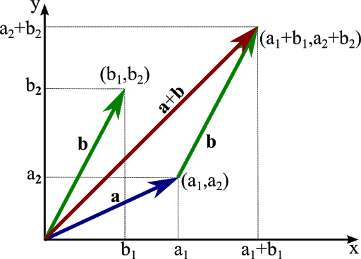
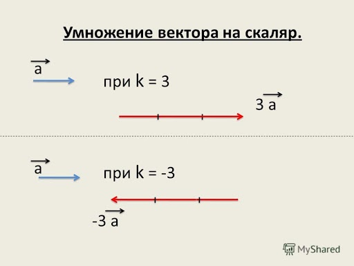

## Задания на дом

Напишите класс для математического вектора.


**Вектор**— направленный отрезок прямой. Вектор задается двумя числами.


### Операции с векторами

**Сложение векторов:**




**Вычитание векторов:**


    
**Умножение вектора на скаляр(число):**



**boild**

 - [x] check1
 - [ ] check2

```pytho
<!--stackedit_data:
eyJoaXN0b3J5IjpbMTkxMjY1MjkxMF19
-->