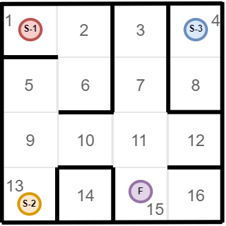

### Задание "Лабиринт-1"
Дана схема лабиринта:

Дана схема района, указано местоположение вашего дома и банка.

**Определите**: Можно ли добраться из дома до банка, описав схему района в виде "списока смежности" и расположение объектов (дом, банк).

**Выведите ответ в формате:**

**Сan/can't** go to the **bank**
