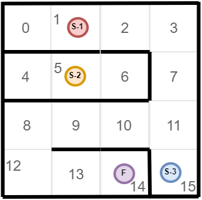

### Задание "Лабиринт-2"
Дана схема лабиринта:

Схема района и расположение объектов изменились.

Адаптируйте решение из задания "Maze-1" для новой конфигурации лабиринта

**Выведите ответ в формате:**

**Сan/can't** go to the **bank**
