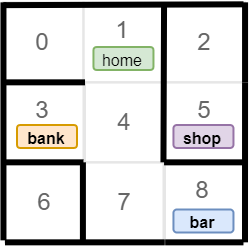

### Задание "Лабиринт-4"
Дана схема лабиринта:

Снова меняем схему района, а так же добавляем еще один объект - "Бар>".

Адаптируйте решение из предыдущей задачи для новой конфигурации лабиринта и нового объекта.

**Выведите ответ в формате:**

**Сan/can't** go to the **bank** \
**Сan/can't** go to the **shop** \
**Сan/can't** go to the **bar** 