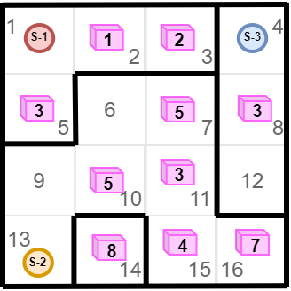

### Задание-4 "Лабиринт с сокровищами"
Дана схема лабиринта:

S-1, S-2, S-3 - точки старта \
Розовые кубы - сокровища. Цифра на них - их ценность

Стартовав из каждой точки вы можете собрать только по два сокровища(больше не унести)

На какую суммарную ценность можно собрать сокровищ, стартовав из разных точек?
**Выведите ответ в формате:**: \
Из точки S-... можно собрать сокровищ суммарной ценностью ... \
... \
Из точки S-... можно собрать сокровищ суммарной ценностью ...

