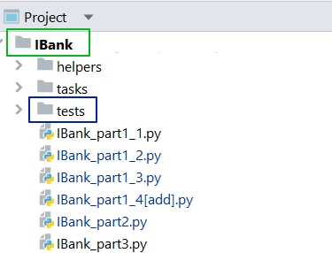
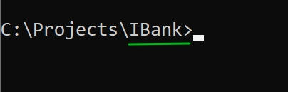

# Запуск тестов:
1. Рекомендуемая структура проекта:

1. Установите модуль pytest: `pip install pytest`
1. Откройте терминал и перейдите в директорию вашего проекта:

1. В файле с тестом **test_account_part1.py**, исправьте import
1. В терминале наберите: `python -m pytest -v tests\test_account_part1.py`